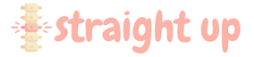

# Straight Up: Posture Reminder
A Google Chrome extension to set recurring reminders to fix your posture. 

Built with Javascript, HTML/CSS, Chrome Alarms API and Chrome Notifications API.

## Demo

## Installation
1. Download or clone this repository (`git clone https://github.com/sahuashi/straight-up.git`).
2. Load the repository folder [as a Chrome extension](https://developer.chrome.com/docs/extensions/mv2/getstarted/):
   * Open the Extension Management page by navigating to `chrome://extensions`
   * Enable `Developer Mode` by clicking the toggle switch next to `Developer Mode`
   * Click the `LOAD UNPACKED` button and select the extension directory
3. After loading the folder, the extension should appear on the Extension Management page.

## License
Released under the MIT License. See `LICENSE` for more information.

## Acknowledgments
* [Chrome Alarms API](https://developer.chrome.com/docs/extensions/reference/alarms/)
* [Chrome Notifications API](https://developer.chrome.com/docs/extensions/reference/notifications/)
* [Codepen](https://codepen.io/wilsonpage/pen/cxKEs)
* [Demo Timer](https://pomofocus.io/)
